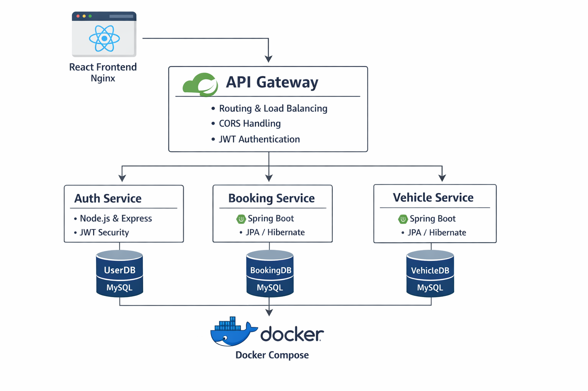

# 🚗 AutoCare – Full-Stack Microservices Application

  <b>A production-style microservices application built with modern DevOps & Cloud-native practices</b>

  
  
  
  
  

---

## 📌 Project Overview

**AutoCare** is a **full-stack microservices-based application** designed to simulate a **real-world production system**.

The project focuses on:
- Clean microservices separation  
- API Gateway-based architecture  
- Secure authentication with JWT  
- Dockerized services with isolated databases  

This project goes beyond tutorials and demonstrates **how real systems are designed, debugged, and run in production**.

---

## 🏗️ System Architecture

  

### 🔄 Request Flow
